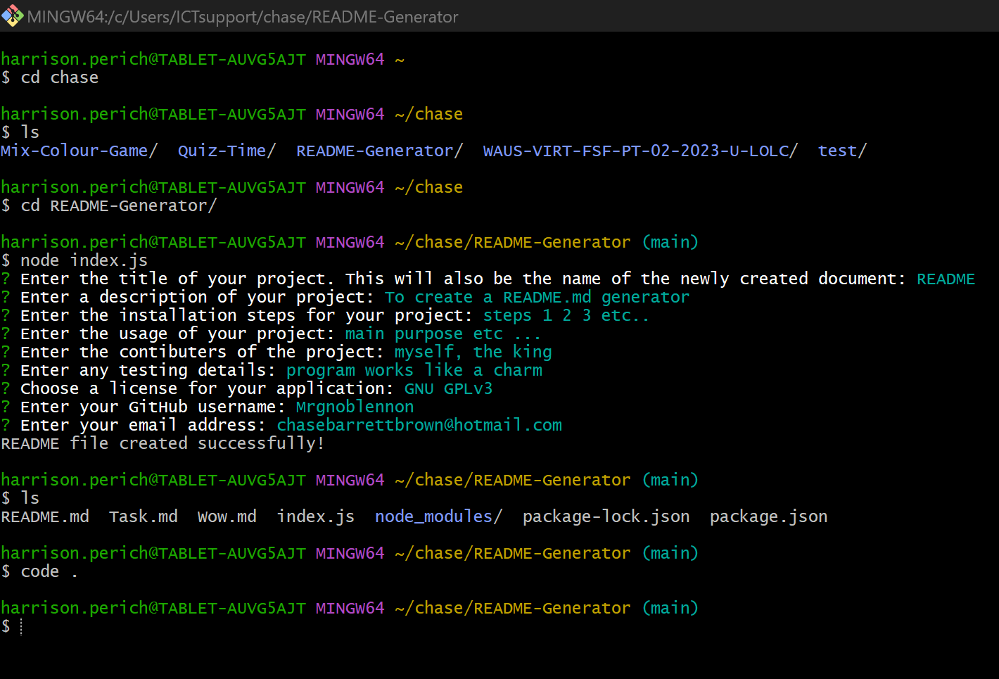
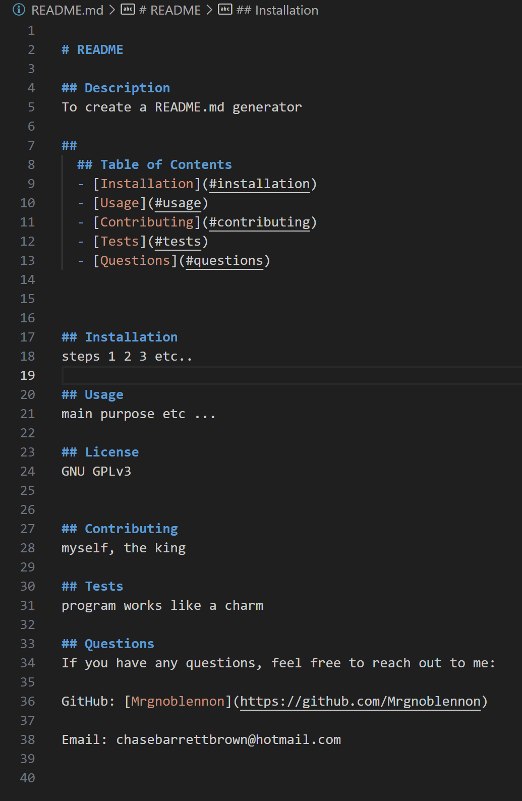
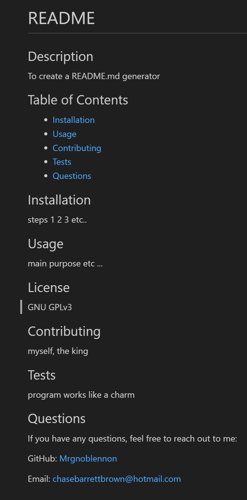

# README Generator

## Description
To create a README.md generator through utilizing node.js and inquirer. The user
will be propted when the code has been executed through the command line terminal,
each prompt will require an answer which will then be displayed in the mark down file.

## 
  ## Table of Contents
  - [Installation](#installation)
  - [Usage](#usage)
  - [Contributing](#contributing)
  - [Tests](#tests)
  - [Questions](#questions)
  

## Installation
Node.js 
inquirer v8.2.4
Visual Studio Code

## Usage
To create a README.md when prompted through the command line terminal

## License
N/A

## Contributing
Chase Barrett-Brown

## Tests
N/A

## Screenshot
Command line log

Newly created md document

Live version

## Questions
If you have any questions, feel free to reach out to me:

GitHub: [Mrgnoblennon](https://github.com/Mrgnoblennon)

Email: chasebarrettbrown@hotmail.com

